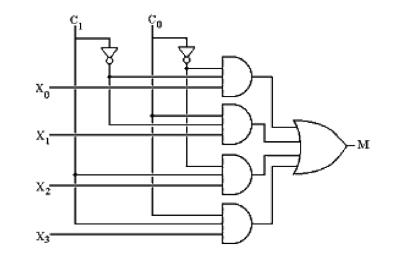

## Post test
#### Please attempt the following questions

Q1. The difference output of a full subtractor is same as \_\_\_\_\_\_\_\_\_\_\_\_  

A  Carry output of full adder  
B  Sum output of full adder  
C   Output of 3- bit even parity generator  
<b>D  Both options B and C</b>  
 

Q2. If minuend = 0, subtrahend = 1 and borrow input = 1 in a full subtractor then the borrow output will be \_\_\_\_\_\_\_\_\_\_  

A  0  
<b>B  1</b>  
C  Floating  
D  Can't say  
 
  
   
Q3. Solve the binary problem: 10100001 - 00010110 = \_\_\_\_\_\_\_\_  

<b>A  10001011</b>  
B  00010011  
C  11010100  
D  01011100  
 
  
   
Q4. A serial subtractor can be obtained by converting the serial adder by using the \_\_\_\_\_\_\_\_\_\_\_\_\_  

A  1’s complement system  
<b>B  2’s complement system</b>  
C  10’s complement system  
D  9’s complement  
 
  
  
Q5. A basic multiplexer principle can be demonstrated through the use of a \_\_\_\_\_  

A  Single-pole relay  
B  DPDT switch  
<b>C  Rotary switch</b>  
D  Linear stepper  
 
  
   
Q6. In the given 4-to-1 multiplexer, if C1 = 0 and C0 = 1 then the output M is \_\_\_\_\_.  

A  X0  
<b>B  X1</b>  
C  X2  
D  X3  
 
  
   
Q7. In multiplexer IC 74153, if both enable inputs are high, selection inputs S0\= 0 and S1\=1 then outputs Za and Zb will be \_\_\_\_ and \_\_\_\_ respectively  

<b>A  0,0</b>  
B  1,1  
C  Ia0,Ib0  
D  Ia2,Ib2  
 
  
  
Q8. The output Za and Zb are respectively present at pin no. \_\_\_\_\_\_ and \_\_\_\_\_\_ of multiplexer IC 74153  

<b>A  7,9</b>  
B  8,16  
C  3,13  
D  9,10  
 
  
   
Q9. IC 74352 is a  

A  8 to 1 multiplexer IC with inverted output  
B  16 to 1 multiplexer IC with non inverted output  
<b>C  Dual 4 to 1 multiplexer IC with inverted output</b>  
D  1 to 8demultiplexer IC with complementary outputs  
 
  
   
Q10. What is data routing in a multiplexer?  

A  It spreads the information to the control unit  
B  It can be used to route data from one of several sources to destination  
C  It is an application of multiplexer  
<b>D  Both, it can be used to route data and it is an application of multiplexer</b>  

 

  