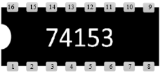
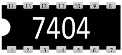
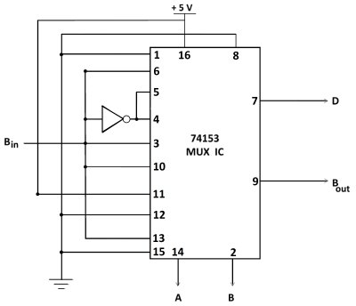
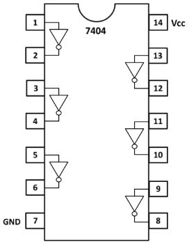
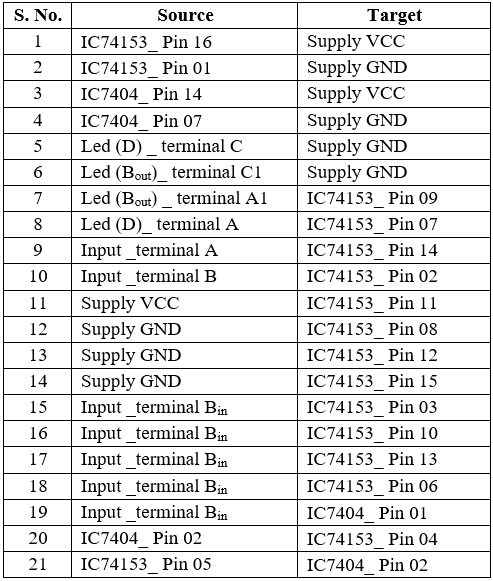

## Procedure 

#### Click on 'Full Subtractor using 4:1 MUX' button in **Simulation** tab.  
  
Follow these steps to perform the experiment: 

**1.** Fill the Truth Table.  
**2.** Click on the component button to place the component.  

  
&emsp; &emsp; &emsp; &emsp; &emsp; ")&emsp; ")   &emsp; &emsp; 

**Fig. 1: Components**
 
 

**3.** To design the full subtractor circuit, use the circuit diagram and pin diagram of the IC or use connection table provided below.  
**4.** Connect outputs **D** and **Bout** to LEDs labelled **D** and **Bout** respectively.  

&emsp;&emsp; 

**Fig. 2: Circuit diagram of full subtractor using 4:1 MUX.**&emsp;&emsp; **Fig. 3: Pin diagram of NOT-Gate IC-7404.**

**Table 1: Connection table**

 
 

**5.** Once the connections are made, click on '**Check Connections**' button. If connections are right, the '**Start Simulation**' button will become active. Click on it to start the simulation and use the input toggle switches marked '**A**', '**B**' and '**Bin**' and observe the output. 

