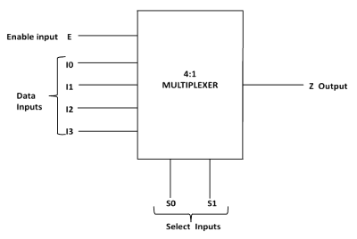
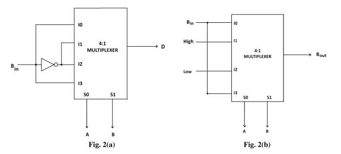
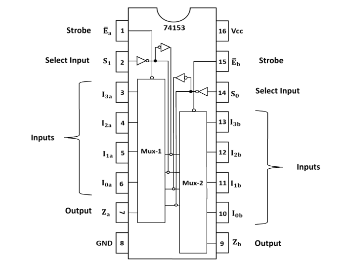
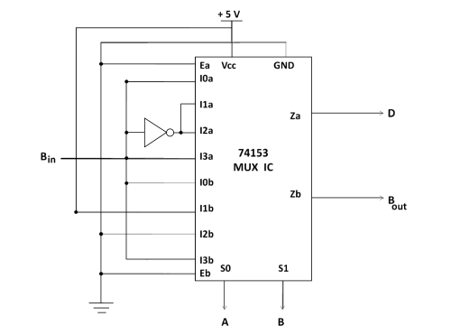
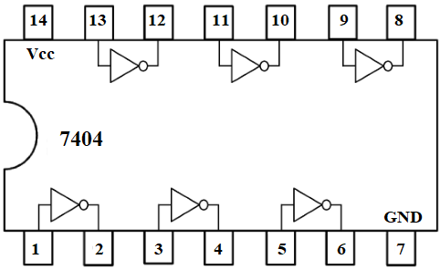

### Introduction

### **Full Subtractor**

Different variants of an adder and a subtractor form an integral part of modern ICs and are found in Arithmetic Logic Units (ALUs) and the digital Signal Processing (DSP) units. A half subtractor is a combinational circuit that performs subtraction of two binary bits. It has two inputs (minuend and subtrahend) and two outputs Difference (**D**) and Borrow (**Bout**). Half-subtractor is used to subtract the LSB of the subtrahend to the LSB of the minuend when one binary number is subtracted from another. Subtraction is done according to the rules of binary subtraction. A disadvantage of the Half Subtractor circuit is that there is no provision for a ‘Borrow-in’ from the previous circuit when subtracting multiple data bits from each other. A full subtractor circuit takes into account this borrow-in input from the previous circuit. In Full Subtractor circuit there are three inputs, A which is Minuend, B which is Subtrahend and Borrow in (**Bin**) of the previous stage and two outputs Difference (**D**) and Borrow out (**Bout**). The Boolean expressions for Difference and Borrow are  

**Difference** = A⊕B⊕Bin  
**Borrow** = A'.Bin + B.Bin + B.A' 

The operations can be summarized in a truth table as, 

**Table-1: Truth table of full subtractor**
<table style="text-align:center;color:black;">
<tr style="border:1px solid black;font-size:120%;border-collapse:collapse;">
<th rowspan="2"; style="border:1px solid black;border-collapse:collapse;">S. No.</th>
<th colspan="3"; style="border:1px solid black;border-collapse:collapse;">Input</th>
<th colspan="2"; style="border:1px solid black;border-collapse:collapse;" >Output</th>
</tr>

<tr>
<th style="border:1px solid black;font-size:120%;border-collapse:collapse;">A</th>
<th style="border:1px solid black;font-size:120%;border-collapse:collapse;">B</th>
<th style="border:1px solid black;font-size:120%;border-collapse:collapse;">Bin</th>
<th style="border:1px solid black;font-size:120%;border-collapse:collapse;">Difference D</th>
<th style="border:1px solid black;font-size:120%;border-collapse:collapse;">Borrow Bout</th>
</tr>

<tr>
<td style="border:1px solid black;font-size:110%;border-collapse:collapse;">1</td>
<td style="border:1px solid black;font-size:110%;border-collapse:collapse;">0</td>
<td style="border:1px solid black;font-size:110%;border-collapse:collapse;">0</td>
<td style="border:1px solid black;font-size:110%;border-collapse:collapse;">0</td>
<td style="border:1px solid black;font-size:110%;border-collapse:collapse;">0</td>
<td style="border:1px solid black;font-size:110%;border-collapse:collapse;">0</td>
</tr>

<tr>
<td style="border:1px solid black;font-size:110%;border-collapse:collapse;">2</td>
<td style="border:1px solid black;font-size:110%;border-collapse:collapse;">0</td>
<td style="border:1px solid black;font-size:110%;border-collapse:collapse;">0</td>
<td style="border:1px solid black;font-size:110%;border-collapse:collapse;">1</td>
<td style="border:1px solid black;font-size:110%;border-collapse:collapse;">1</td>
<td style="border:1px solid black;font-size:110%;border-collapse:collapse;">1</td>
</tr>

<tr>
<td style="border:1px solid black;font-size:110%;border-collapse:collapse;">3</td>
<td style="border:1px solid black;font-size:110%;border-collapse:collapse;">0</td>
<td style="border:1px solid black;font-size:110%;border-collapse:collapse;">1</td>
<td style="border:1px solid black;font-size:110%;border-collapse:collapse;">0</td>
<td style="border:1px solid black;font-size:110%;border-collapse:collapse;">1</td>
<td style="border:1px solid black;font-size:110%;border-collapse:collapse;">1</td>
</tr>

<tr>
<td style="border:1px solid black;font-size:110%;border-collapse:collapse;">4</td>
<td style="border:1px solid black;font-size:110%;border-collapse:collapse;">0</td>
<td style="border:1px solid black;font-size:110%;border-collapse:collapse;">1</td>
<td style="border:1px solid black;font-size:110%;border-collapse:collapse;">1</td>
<td style="border:1px solid black;font-size:110%;border-collapse:collapse;">0</td>
<td style="border:1px solid black;font-size:110%;border-collapse:collapse;">1</td>
</tr>

<tr>
<td style="border:1px solid black;font-size:110%;border-collapse:collapse;">5</td>
<td style="border:1px solid black;font-size:110%;border-collapse:collapse;">1</td>
<td style="border:1px solid black;font-size:110%;border-collapse:collapse;">0</td>
<td style="border:1px solid black;font-size:110%;border-collapse:collapse;">0</td>
<td style="border:1px solid black;font-size:110%;border-collapse:collapse;">1</td>
<td style="border:1px solid black;font-size:110%;border-collapse:collapse;">0</td>
</tr>

<tr>
<td style="border:1px solid black;font-size:110%;border-collapse:collapse;">6</td>
<td style="border:1px solid black;font-size:110%;border-collapse:collapse;">1</td>
<td style="border:1px solid black;font-size:110%;border-collapse:collapse;">0</td>
<td style="border:1px solid black;font-size:110%;border-collapse:collapse;">1</td>
<td style="border:1px solid black;font-size:110%;border-collapse:collapse;">0</td>
<td style="border:1px solid black;font-size:110%;border-collapse:collapse;">0</td>
</tr>

<tr>
<td style="border:1px solid black;font-size:110%;border-collapse:collapse;">7</td>
<td style="border:1px solid black;font-size:110%;border-collapse:collapse;">1</td>
<td style="border:1px solid black;font-size:110%;border-collapse:collapse;">1</td>
<td style="border:1px solid black;font-size:110%;border-collapse:collapse;">0</td>
<td style="border:1px solid black;font-size:110%;border-collapse:collapse;">0</td>
<td style="border:1px solid black;font-size:110%;border-collapse:collapse;">0</td>
</tr>

<tr>
<td style="border:1px solid black;font-size:110%;border-collapse:collapse;">8</td>
<td style="border:1px solid black;font-size:110%;border-collapse:collapse;">1</td>
<td style="border:1px solid black;font-size:110%;border-collapse:collapse;">1</td>
<td style="border:1px solid black;font-size:110%;border-collapse:collapse;">1</td>
<td style="border:1px solid black;font-size:110%;border-collapse:collapse;">1</td>
<td style="border:1px solid black;font-size:110%;border-collapse:collapse;">1</td>
</tr>

</table>

  

Full subtractor can be implemented using a 4:1multiplexer.

### **Multiplexer**

A multiplexer is a combinational circuit which selects binary information present on any one of the input lines, depending upon the logic status of the selection inputs, and routes it to the output line. If there are m selection lines, then the number n of maximum possible input lines is 2m and the multiplexer is referred to as a n-to-1 multiplexer. A 4:1 multiplexer (Fig. 1) has 4 input lines and 2 selection lines. Table 2 shows the output of a 4:1 multiplexer.

 

**Fig-1: A 4:1 Multiplexer**  

**Table-2: Truth table of 4:1 Multiplexer**

<table style="text-align:center;color:black;">
<tr style="border:1px solid black;font-size:120%;border-collapse:collapse;">
<th colspan="2"; style="border:1px solid black;border-collapse:collapse;">Select Lines</th>
<th style="border:1px solid black;border-collapse:collapse;" >Output</th>
</tr>

<tr>
<th style="border:1px solid black;font-size:120%;border-collapse:collapse;">S0</th>
<th style="border:1px solid black;font-size:120%;border-collapse:collapse;">S1</th>
<th style="border:1px solid black;font-size:120%;border-collapse:collapse;text-align:center">Z</th>
</tr>

<tr>
<td style="border:1px solid black;font-size:110%;border-collapse:collapse;">0</td>
<td style="border:1px solid black;font-size:110%;border-collapse:collapse;">0</td>
<td style="border:1px solid black;font-size:110%;border-collapse:collapse;">I0</td>
</tr>

<tr>
<td style="border:1px solid black;font-size:110%;border-collapse:collapse;">0</td>
<td style="border:1px solid black;font-size:110%;border-collapse:collapse;">1</td>
<td style="border:1px solid black;font-size:110%;border-collapse:collapse;">I1</td>
</tr>

<tr>
<td style="border:1px solid black;font-size:110%;border-collapse:collapse;">1</td>
<td style="border:1px solid black;font-size:110%;border-collapse:collapse;">0</td>
<td style="border:1px solid black;font-size:110%;border-collapse:collapse;">I2</td>
</tr>

<tr>
<td style="border:1px solid black;font-size:110%;border-collapse:collapse;">1</td>
<td style="border:1px solid black;font-size:110%;border-collapse:collapse;">1</td>
<td style="border:1px solid black;font-size:110%;border-collapse:collapse;">I3</td>
</tr>

</table>

  

### **Implementation of a Full Subtractor using 4:1Multiplexer**

In a full subtractor there are three inputs and A, B and Bin and two outputs D and Bout. The Booleanfunctions for Difference and Borrow in SOP form are as follows:

D(A,B,Bin)= Σ(1,2,4,7)        
Bout(A,B,Bin)= Σ(1,2,3,7)  

In view of these the output table of full subtractor can be rewritten as

**Table-3: Output of full subtractor in terms of input**

<table style="text-align:center;color:black;">
<tr style="border:1px solid black;font-size:120%;border-collapse:collapse;">
<th rowspan="2"; style="border:1px solid black;border-collapse:collapse;">S. No.</th>
<th colspan="3"; style="border:1px solid black;border-collapse:collapse;">Input</th>
<th colspan="2"; style="border:1px solid black;border-collapse:collapse;" >Output in terms of Bin</th>
</tr>

<tr>
<th style="border:1px solid black;font-size:120%;border-collapse:collapse;">A</th>
<th style="border:1px solid black;font-size:120%;border-collapse:collapse;">B</th>
<th style="border:1px solid black;font-size:120%;border-collapse:collapse;">Bin</th>
<th style="border:1px solid black;font-size:120%;border-collapse:collapse;">Difference D</th>
<th style="border:1px solid black;font-size:120%;border-collapse:collapse;">Borrow Bout</th>
</tr>

<tr>
<td style="border:1px solid black;font-size:120%;border-collapse:collapse;">1</td>
<td rowspan="2"; style="border:1px solid black;font-size:120%;border-collapse:collapse;">0</td>
<td rowspan="2"; style="border:1px solid black;font-size:120%;border-collapse:collapse;">0</td>
<td style="border:1px solid black;font-size:120%;border-collapse:collapse;">0</td>
<td rowspan="2"; style="border:1px solid black;font-size:120%;border-collapse:collapse;align:center;">Bin</td>
<td rowspan="2"; style="border:1px solid black;font-size:120%;border-collapse:collapse;">Bin</td>
</tr>

<tr>
<td style="border:1px solid black;font-size:120%;border-collapse:collapse;">2</td>
<td style="border:1px solid black;font-size:120%;border-collapse:collapse;">1</td>
</tr>

<tr>
<td style="border:1px solid black;font-size:120%;border-collapse:collapse;">3</td>
<td rowspan="2"; style="border:1px solid black;font-size:120%;border-collapse:collapse;">0</td>
<td rowspan="2"; style="border:1px solid black;font-size:120%;border-collapse:collapse;">1</td>
<td style="border:1px solid black;font-size:120%;border-collapse:collapse;">0</td>
<td rowspan="2"; style="border:1px solid black;font-size:120%;border-collapse:collapse;">Bin'</td>
<td rowspan="2"; style="border:1px solid black;font-size:120%;border-collapse:collapse;">1</td>
</tr>

<tr>
<td style="border:1px solid black;font-size:120%;border-collapse:collapse;">4</td>
<td style="border:1px solid black;font-size:120%;border-collapse:collapse;">1</td>
</tr>

<tr>
<td style="border:1px solid black;font-size:120%;border-collapse:collapse;">5</td>
<td rowspan="2"; style="border:1px solid black;font-size:120%;border-collapse:collapse;">1</td>
<td rowspan="2"; style="border:1px solid black;font-size:120%;border-collapse:collapse;">0</td>
<td style="border:1px solid black;font-size:120%;border-collapse:collapse;">0</td>
<td rowspan="2"; style="border:1px solid black;font-size:120%;border-collapse:collapse;">Bin'</td>
<td rowspan="2"; style="border:1px solid black;font-size:120%;border-collapse:collapse;">0</td>
</tr>

<tr>
<td style="border:1px solid black;font-size:120%;border-collapse:collapse;">6</td>
<td style="border:1px solid black;font-size:120%;border-collapse:collapse;">1</td>
</tr>

<tr>
<td style="border:1px solid black;font-size:120%;border-collapse:collapse;">7</td>
<td rowspan="2"; style="border:1px solid black;font-size:120%;border-collapse:collapse;">1</td>
<td rowspan="2"; style="border:1px solid black;font-size:120%;border-collapse:collapse;">1</td>
<td style="border:1px solid black;font-size:120%;border-collapse:collapse;">0</td>
<td rowspan="2"; style="border:1px solid black;font-size:120%;border-collapse:collapse;">Bin</td>
<td rowspan="2"; style="border:1px solid black;font-size:120%;border-collapse:collapse;">Bin</td>
</tr>

<tr>
<td style="border:1px solid black;font-size:120%;border-collapse:collapse;">8</td>
<td style="border:1px solid black;font-size:120%;border-collapse:collapse;">1</td>

</tr>
</table>

  

On comparing tables 2 and 3 we find that the difference and borrow bits of full subtractor can be implemented using 4:1 multiplexer as follows:  
The selection lines of the multiplexer be given values as per the two inputs A and B of the full subtractor.

#### **For Difference Output**

Two input lines of the multiplexer be given values corresponding to third input Bin of the subtractor and other two lines be given its complemented values Bin'.

#### **For Borrow Output**

Two input lines be given input values corresponding to third input Bin of the subtractor and out of rest two one is always high and the other is always low.  
The diagrammatic representation is given in Figures 2(a) and 2(b):

**Fig.-2: Implementation of (a) Difference and (b) Borrow outputs of a full subtractor with a 4:1 multiplexer**

In the experiment the Full subtractor circuit is designed using a dual multiplexer IC 74153 and a NOT gate IC7404.

### **74153 Multiplexer IC**

The 74153 IC is a dual 4 input multiplexer with common selection lines S0 and S1 and individual active LOW enable inputs Ea and Eb for each section.It can select two bits of data Ia and Ib from up to four sources.The selection lines control the particular input to be multiplexed and sent to the output Zi (i = a, b). The two buffered outputs present data in the true (non-inverted) form. When the Enables (Ea, Eb) are HIGH, the corresponding outputs (Za, Zb) are forced LOW. The pin diagram is shown in fig 3. More details can be found on [Datasheet](images/74LS153.pdf).

  
### **Pin Name**

**S0,S1 -** Common Select Input  
**E -** Enable (Active LOW) Input  
**I0, I1, I2, I3 -** Multiplexer Inputs  
**Z-** Multiplexer Output

**Fig.3-Pin diagram of 74153 MUX IC**

The circuit diagram of Full Subtractor using dual multiplexer IC 74153 is shown in Fig.4 and the function table of 74153 MUX IC for full multiplexer is shown in table 4.

**Fig.-4: Circuit diagram of full subtractor using 74153 MUX**
 

**Table-4: Function table of 74153 MUX IC for full subtractor**

<table style="text-align:center;color:black;">
<tr style="border:1px solid black;font-size:120%;border-collapse:collapse;">
<th colspan="2"; style="border:1px solid black;border-collapse:collapse;">Select inputs</th>
<th colspan="4"; style="border:1px solid black;border-collapse:collapse;">Inputs (a)</th>
<th colspan="4"; style="border:1px solid black;border-collapse:collapse;">Inputs (b)</th>
<th colspan="4"; style="border:1px solid black;border-collapse:collapse;" >Output</th>
</tr>

<tr>
<th style="border:1px solid black;font-size:120%;border-collapse:collapse;">S0</th>
<th style="border:1px solid black;font-size:120%;border-collapse:collapse;">S1</th>
<th style="border:1px solid black;font-size:120%;border-collapse:collapse;">I0a</th>
<th style="border:1px solid black;font-size:120%;border-collapse:collapse;">I1a</th>
<th style="border:1px solid black;font-size:120%;border-collapse:collapse;">I2a</th>
<th style="border:1px solid black;font-size:120%;border-collapse:collapse;">I3a</th>
<th style="border:1px solid black;font-size:120%;border-collapse:collapse;">I0b</th>
<th style="border:1px solid black;font-size:120%;border-collapse:collapse;">I1b</th>
<th style="border:1px solid black;font-size:120%;border-collapse:collapse;">I2b</th>
<th style="border:1px solid black;font-size:120%;border-collapse:collapse;">I3b</th>
<th colspan="2"; style="border:1px solid black;font-size:120%;border-collapse:collapse;text-align:center">Za</th>
<th colspan="2"; style="border:1px solid black;font-size:120%;border-collapse:collapse;text-align:center">Zb</th>
</tr>

<tr>
<th style="border:1px solid black;font-size:120%;border-collapse:collapse;">A</th>
<th style="border:1px solid black;font-size:120%;border-collapse:collapse;">B</th>
<th style="border:1px solid black;font-size:120%;border-collapse:collapse;">Bin</th>
<th style="border:1px solid black;font-size:120%;border-collapse:collapse;">Bin'</th>
<th style="border:1px solid black;font-size:120%;border-collapse:collapse;">Bin'</th>
<th style="border:1px solid black;font-size:120%;border-collapse:collapse;">Bin</th>
<th style="border:1px solid black;font-size:120%;border-collapse:collapse;">Bin</th>
<th style="border:1px solid black;font-size:120%;border-collapse:collapse;">1</th>
<th style="border:1px solid black;font-size:120%;border-collapse:collapse;">0</th>
<th style="border:1px solid black;font-size:120%;border-collapse:collapse;">Bin</th>
<th colspan="2"; style="border:1px solid black;font-size:120%;border-collapse:collapse;text-align:center">D</th>
<th colspan="2"; style="border:1px solid black;font-size:120%;border-collapse:collapse;text-align:center">Bout</th>
</tr>

<tr>
<td style="border:1px solid black;font-size:120%;border-collapse:collapse;">0</td>
<td style="border:1px solid black;font-size:120%;border-collapse:collapse;">0</td>
<td style="border:1px solid black;font-size:120%;border-collapse:collapse;">0</td>
<td style="border:1px solid black;font-size:120%;border-collapse:collapse;">1</td>
<td style="border:1px solid black;font-size:120%;border-collapse:collapse;">1</td>
<td style="border:1px solid black;font-size:120%;border-collapse:collapse;">0</td>
<td style="border:1px solid black;font-size:120%;border-collapse:collapse;">0</td>
<td style="border:1px solid black;font-size:120%;border-collapse:collapse;">1</td>
<td style="border:1px solid black;font-size:120%;border-collapse:collapse;">0</td>
<td style="border:1px solid black;font-size:120%;border-collapse:collapse;">0</td>
<td rowspan="2"; style="border:1px solid black;font-size:120%;border-collapse:collapse;">I0a</td>
<td style="border:1px solid black;font-size:120%;border-collapse:collapse;">0</td>
<td rowspan="2"; style="border:1px solid black;font-size:120%;border-collapse:collapse;">I0b</td>
<td style="border:1px solid black;font-size:120%;border-collapse:collapse;">0</td>
</tr>

<tr>
<td style="border:1px solid black;font-size:120%;border-collapse:collapse;">0</td>
<td style="border:1px solid black;font-size:120%;border-collapse:collapse;">0</td>
<td style="border:1px solid black;font-size:120%;border-collapse:collapse;">1</td>
<td style="border:1px solid black;font-size:120%;border-collapse:collapse;">0</td>
<td style="border:1px solid black;font-size:120%;border-collapse:collapse;">0</td>
<td style="border:1px solid black;font-size:120%;border-collapse:collapse;">1</td>
<td style="border:1px solid black;font-size:120%;border-collapse:collapse;">1</td>
<td style="border:1px solid black;font-size:120%;border-collapse:collapse;">1</td>
<td style="border:1px solid black;font-size:120%;border-collapse:collapse;">0</td>
<td style="border:1px solid black;font-size:120%;border-collapse:collapse;">1</td>
<td style="border:1px solid black;font-size:120%;border-collapse:collapse;">1</td>
<td style="border:1px solid black;font-size:120%;border-collapse:collapse;">1</td>
</tr>

<tr>
<td style="border:1px solid black;font-size:120%;border-collapse:collapse;">0</td>
<td style="border:1px solid black;font-size:120%;border-collapse:collapse;">1</td>
<td style="border:1px solid black;font-size:120%;border-collapse:collapse;">0</td>
<td style="border:1px solid black;font-size:120%;border-collapse:collapse;">1</td>
<td style="border:1px solid black;font-size:120%;border-collapse:collapse;">1</td>
<td style="border:1px solid black;font-size:120%;border-collapse:collapse;">0</td>
<td style="border:1px solid black;font-size:120%;border-collapse:collapse;">0</td>
<td style="border:1px solid black;font-size:120%;border-collapse:collapse;">1</td>
<td style="border:1px solid black;font-size:120%;border-collapse:collapse;">0</td>
<td style="border:1px solid black;font-size:120%;border-collapse:collapse;">0</td>
<td rowspan="2"; style="border:1px solid black;font-size:120%;border-collapse:collapse;">I1a</td>
<td style="border:1px solid black;font-size:120%;border-collapse:collapse;">1</td>
<td rowspan="2"; style="border:1px solid black;font-size:120%;border-collapse:collapse;">I1b</td>
<td style="border:1px solid black;font-size:120%;border-collapse:collapse;">1</td>
</tr>

<tr>
<td style="border:1px solid black;font-size:120%;border-collapse:collapse;">0</td>
<td style="border:1px solid black;font-size:120%;border-collapse:collapse;">1</td>
<td style="border:1px solid black;font-size:120%;border-collapse:collapse;">1</td>
<td style="border:1px solid black;font-size:120%;border-collapse:collapse;">0</td>
<td style="border:1px solid black;font-size:120%;border-collapse:collapse;">0</td>
<td style="border:1px solid black;font-size:120%;border-collapse:collapse;">1</td>
<td style="border:1px solid black;font-size:120%;border-collapse:collapse;">1</td>
<td style="border:1px solid black;font-size:120%;border-collapse:collapse;">1</td>
<td style="border:1px solid black;font-size:120%;border-collapse:collapse;">0</td>
<td style="border:1px solid black;font-size:120%;border-collapse:collapse;">1</td>
<td style="border:1px solid black;font-size:120%;border-collapse:collapse;">0</td>
<td style="border:1px solid black;font-size:120%;border-collapse:collapse;">1</td>
</tr>

<tr>
<td style="border:1px solid black;font-size:120%;border-collapse:collapse;">1</td>
<td style="border:1px solid black;font-size:120%;border-collapse:collapse;">0</td>
<td style="border:1px solid black;font-size:120%;border-collapse:collapse;">0</td>
<td style="border:1px solid black;font-size:120%;border-collapse:collapse;">1</td>
<td style="border:1px solid black;font-size:120%;border-collapse:collapse;">1</td>
<td style="border:1px solid black;font-size:120%;border-collapse:collapse;">0</td>
<td style="border:1px solid black;font-size:120%;border-collapse:collapse;">0</td>
<td style="border:1px solid black;font-size:120%;border-collapse:collapse;">1</td>
<td style="border:1px solid black;font-size:120%;border-collapse:collapse;">0</td>
<td style="border:1px solid black;font-size:120%;border-collapse:collapse;">0</td>
<td rowspan="2"; style="border:1px solid black;font-size:120%;border-collapse:collapse;">I2a</td>
<td style="border:1px solid black;font-size:120%;border-collapse:collapse;">1</td>
<td rowspan="2"; style="border:1px solid black;font-size:120%;border-collapse:collapse;">I2b</td>
<td style="border:1px solid black;font-size:120%;border-collapse:collapse;">0</td>
</tr>

<tr>
<td style="border:1px solid black;font-size:120%;border-collapse:collapse;">1</td>
<td style="border:1px solid black;font-size:120%;border-collapse:collapse;">0</td>
<td style="border:1px solid black;font-size:120%;border-collapse:collapse;">1</td>
<td style="border:1px solid black;font-size:120%;border-collapse:collapse;">0</td>
<td style="border:1px solid black;font-size:120%;border-collapse:collapse;">0</td>
<td style="border:1px solid black;font-size:120%;border-collapse:collapse;">1</td>
<td style="border:1px solid black;font-size:120%;border-collapse:collapse;">1</td>
<td style="border:1px solid black;font-size:120%;border-collapse:collapse;">1</td>
<td style="border:1px solid black;font-size:120%;border-collapse:collapse;">0</td>
<td style="border:1px solid black;font-size:120%;border-collapse:collapse;">1</td>
<td style="border:1px solid black;font-size:120%;border-collapse:collapse;">0</td>
<td style="border:1px solid black;font-size:120%;border-collapse:collapse;">0</td>
</tr>

<tr>
<td style="border:1px solid black;font-size:120%;border-collapse:collapse;">1</td>
<td style="border:1px solid black;font-size:120%;border-collapse:collapse;">1</td>
<td style="border:1px solid black;font-size:120%;border-collapse:collapse;">0</td>
<td style="border:1px solid black;font-size:120%;border-collapse:collapse;">1</td>
<td style="border:1px solid black;font-size:120%;border-collapse:collapse;">1</td>
<td style="border:1px solid black;font-size:120%;border-collapse:collapse;">0</td>
<td style="border:1px solid black;font-size:120%;border-collapse:collapse;">0</td>
<td style="border:1px solid black;font-size:120%;border-collapse:collapse;">1</td>
<td style="border:1px solid black;font-size:120%;border-collapse:collapse;">0</td>
<td style="border:1px solid black;font-size:120%;border-collapse:collapse;">0</td>
<td rowspan="2"; style="border:1px solid black;font-size:120%;border-collapse:collapse;">I3a</td>
<td style="border:1px solid black;font-size:120%;border-collapse:collapse;">0</td>
<td rowspan="2"; style="border:1px solid black;font-size:120%;border-collapse:collapse;">I3b</td>
<td style="border:1px solid black;font-size:120%;border-collapse:collapse;">0</td>
</tr>

<tr>
<td style="border:1px solid black;font-size:120%;border-collapse:collapse;">1</td>
<td style="border:1px solid black;font-size:120%;border-collapse:collapse;">1</td>
<td style="border:1px solid black;font-size:120%;border-collapse:collapse;">1</td>
<td style="border:1px solid black;font-size:120%;border-collapse:collapse;">0</td>
<td style="border:1px solid black;font-size:120%;border-collapse:collapse;">0</td>
<td style="border:1px solid black;font-size:120%;border-collapse:collapse;">1</td>
<td style="border:1px solid black;font-size:120%;border-collapse:collapse;">1</td>
<td style="border:1px solid black;font-size:120%;border-collapse:collapse;">1</td>
<td style="border:1px solid black;font-size:120%;border-collapse:collapse;">0</td>
<td style="border:1px solid black;font-size:120%;border-collapse:collapse;">1</td>
<td style="border:1px solid black;font-size:120%;border-collapse:collapse;">1</td>
<td style="border:1px solid black;font-size:120%;border-collapse:collapse;">1</td>
</tr>
</table>
 
  
The pin diagram of 7404 NOT gate IC is shown in fig 5.

**Fig.-5: Pin diagram of IC 7404**

  
### Application Of Full Subtractor

1) These are generally employed in ALU (Arithmetic logic unit) in computers to subtract and in CPU and GPU for the applications of graphics to decrease the circuit difficulty.  
2) Subtractors are mostly used for performing arithmetical functions likesubtraction, in electronic calculators as well as digital devices.  
3) These are also applicable in different microcontrollers forarithmetic subtraction, timers, and program counter (PC).  
4) They are also useful for DSP and networking-based systems.

